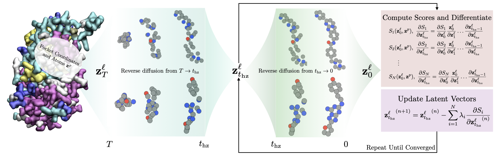

# Guided Multi-objective Generative AI to Enhance Structure-based Drug Design

Offical Implementation of **IDOLpro**: Guided Multi-objective Generative AI to Enhance Structure-based Drug Design.

[](http://arxiv.org/abs/2405.11785)



## Setting up the environment
To set up the environment, we need to install two environemnts - `idolpro` and `mgltools`. The `mgltools` environment is used in `prepare_inputs.sh`.
```bash
micromamba env create -f environment.yml
micromamba env create -f mgltools.yml
```
To activate the environment, run
```bash
micromamba activate idolpro
```
Set `PYTHONPATH` such that all project repos are visible:
```
export PYTHONPATH=$PYTHONPATH:${PWD}:${PWD}/DiffSBDD
```

## Preparing input files
IDOLpro requires both a pdb and pdbqt files with Hs to run. To generate these files for a given pdb file, run:
```bash
bash scripts/prepare_input.sh /path/to/micromamba /path/to/pdb_file
```

## Docking with QuickVina
IDOLpro is configured to evaluate vina scores of the generated molecules with QuickVina2. The binary file required for running Quickvina2 can be downloaded from [here](https://qvina.github.io/).

## De-novo generation
For de-novo generation with the default parameters, run:
```bash
python PLOpt/run_pipeline.py --protein <protein file> --ligand <ligand file>
```
The ligand file is used to identify the pocket in the protein. With the default parameters, this will generate 100 ligands
in the specified protein pocket.

To see which parameters can be configured, run
 ```bash
 python PLOpt/run_pipeline.py --help
 ```

## Lead Optimization
For the tool to generate and optimize atoms around a fixed scaffold there are two options. To fix a scaffold that is generated using rdkit's Murcko Scaffold method on the sdf file, run:
```bash
python PLOpt/run_pipeline.py --protein <protein file> --ligand <ligand file> --lig-fixed True
```
If you would like to specify the atoms to fix, you can input a list of atom indices:

```bash
python -m PLOpt/run_pipeline.py --protein <protein file> --ligand <ligand file> --lig-fixed atom_fixed_0 atom_fixed_1 ...
```
This will fix atoms specified by `--lig-fixed` (atom numbering is determined by the `.sdf` file).

## Analyzing output
As an example, assume you run IDOLpro with the following command:
```bash
python PLOpt/run_pipeline.py --protein protein.pdb --ligand ligand.sdf
```
This will create a directory `results/protein_ligand`. A run will produce the following files:
```bash
ls -1 results/protein_ligand

data.pt
generated_ligands.sdf
stats.csv
```
`generated_ligands.sdf` is An `.sdf` containing all generated ligands.

`stats.csv` contains the individual statisitics for each generated ligand. For some metrics, statistics for both the final (IDOLpro) and the initial (DiffSBDD) ligands are collected. For example, for SA, `stats.csv` contains entries `sa` (IDOLpro), and `sa_0` (DiffSBDD). The following statistics are collected for the initial and final ligands:
* `vina`: The Vina score as evalauted by QVINA.
* `smiles`: SMILES string.
* `sa`: The Synthetic Accessbility score.
* `qed`: The Qunatitative Estimation of Drug-Likeness.
* `logp`: The logp.
* `lipinski`: How many of Lipinski's rule of 5 the ligand satisfies.

The following statistics are collected only for the final ligand (IDOLpro).
* `vina_raw`: The Vina score without docking as evaluated by QVINA. 
* `rank`: The rank of the ligand in the list of ligands generated. This is based on the summing the optimized metrics.
* `time`: The time in the optimization at which the ligand was generated.
* `traj_length`: How many times the latent variables were optimized to yield the generated ligand.
* `tanimoto_ref`: The tanimoto similarity w.r.t. the reference ligand.
* `tanimoto_traj`: The tanimoto similarity w.r.t. the initial (DiffSBDD) ligand.

`data.pt` contains all of the information in `stats.csv` alongside a few additional metrics - the total time required to run IDOLpro for the given protein pocket, and the initial (DiffSBDD) and final (IDOLpro) pocket diversity.

## Benchmarks

### Crossdocked
Download and extract the data as described in [Pocket2Mol](https://github.com/pengxingang/Pocket2Mol/tree/main/data).

Extract the test data by running:
```
python scripts/crossdocked_extract_test.py /path/to/crossdocked_pocket10 /path/to/split_by_name.pt
```
This will create a directory `idolpro/data/crossdocked_test` containing all data points used in the benchmark. IDOLpro is configured to run with the same parameters used to obtain results in the paper. To re-create the results for a given data point, e.g. 14gs_cbd, run:
```
bash scripts/prepare_inputs.sh /path/to/micromamba data/crossdocked_test/14gs_cbd.pdb

python PLOpt/run_pipeline.py --protein data/crossdocked_test/14gs_cbd.pdb --ligand data/crossdocked_test/14gs_cbd.sdf
```

### Binding-MOAD
Download and extract the data as described in [DiffSBDD](https://github.com/arneschneuing/DiffSBDD?tab=readme-ov-file#binding-moad).

Extract the test data by running:
```
python scripts/binding_moad_extract_test.py /path/to/binding_moad
```
This will create a directory `idolpro/data/binding_moad_test` containing all data points used in the benchmark. IDOLpro is configured to run with the same parameters used to obtain results in the paper. To re-create the results for a given data point, e.g. 1BXM-bio1_ERG:A:99, run:
```
bash scripts/prepare_inputs.sh /path/to/micromamba data/crossdocked_test/1BXM-bio1.pdb

python PLOpt/run_pipeline.py --protein data/crossdocked_test/1BXM-bio1.pdb --ligand data/crossdocked_test/1BXM-bio1_ERG:A:99.sdf
```

## Citation
```
@article{kadan2024guided,
  title={Guided Multi-objective Generative AI to Enhance Structure-based Drug Design},
  author={Kadan, Amit and Ryczko, Kevin and Lloyd, Erika and Roitberg, Adrian and Yamazaki, Takeshi},
  journal={arXiv preprint arXiv:2405.11785},
  year={2024}
}
```
